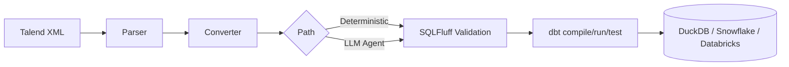

This repo has dbt models used to demonstrate GitHub connection with dbt-model-agent app.

## Architecture

```mermaid
graph LR
    A[Talend XML] --> B[Parser]
    B --> C[Converter]
    C --> D{Path}
    D -->|Deterministic| E[SQLFluff Validation]
    D -->|LLM Agent| E
    E --> F[dbt compile/run/test]
    F --> G[(DuckDB / Snowflake / Databricks)]
```
